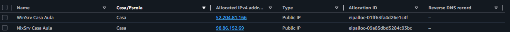
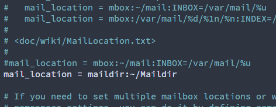
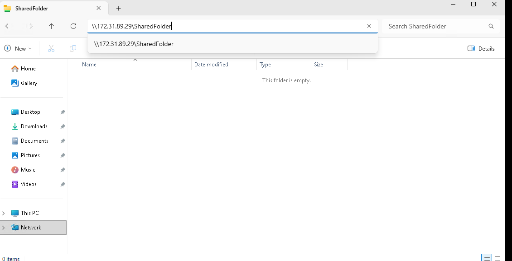

# WinSrv(Windows Server)[DNS + AD + FTP + SMB] --- NixSrv(Linux Server)[Nginx/apache2, SMTP, Imap/pop3]

Req: Um dominio. (No-IP/Cloudflare). Em caso pode ser usado o proprio DNS do WinSrv. Ambas alternativas vãp ser exploradas.

## Iniciar as duas Maquinas WinSrv, NixSrv

### Iniciando o NixSrv.

Começemos por criar a maquina do NixSrv.
Adicionem um nome a escolha. O sistema operacional a ser escolhido é o **ubuntu server**, a arquitetura pode ser mantida em **64bits / x86**, Selecionem a vossa chave de escola/casa no keypair a instancia deve ser um **t3.small**.
Criamos um security group novo por motivo de organização e de aprendizado.


### Iniciando o WinSrv.

Agora criamos a maquina WinSrv
Adicionem um nome a escolha. O sistema operacional a ser escolhido é o **Windows server**, a arquitetura é mantida em **64bits / x86**(Não Alteravel), Selecionem a vossa chave de escola/casa no keypair a instancia deve ser um **c5.large**.
Por motivo de simplicidade usaremos o **security group do NixSrv**.


## Elastic IPs

Usaremos Elastic IPs como forma de manter o IP Publico e Privado sempre fixos para motivos de DNS, para evitar ter que trocar os mesmos toda a hora.
Para configurar é do seguinte jeito




Apos os dois IPs Criados, Clicamos botão direito em um, clicamos associar, lá selecionaremos a nossa instancia.
Repetimos os mesmos passos para a outra instancia.

## Conectar a Maquina Linux

Abrindo o termius, colocaremos os dados da maquina Linux (IP, User, Key).

*Ex:*   
.

Conectados ao terminal executaremos o seguinte comando (Ou seguintes se dividirem o comando em partes.)
`sudo apt update && sudo apt upgrade -y && sudo apt install nginx certbot python3-certbot-nginx -y` 

**OU(dividido):** 

`sudo apt update` (Atualiza as listas com os pacotes no linux)

`sudo apt upgrade -y` (Atualiza os pacotes instalados no sistema)

`sudo apt install nginx certbot python3-certbot-nginx -y` (Instala os seguintes pacotes na maquina linux)

``` O -y serve para confirmar qualquer questão sobre o upgrade ou instalação de pacotes```


Apos isso executaremos `hostnamectl set-hostname example.com` (Troquem o example.com pelo vosso dominio.)

Apos tudo instalado executaremos `sudo reboot` para reiniciar a maquina.


## Configuração do server NGINX
Agora com a maquina reiniciada. executaremos `sudo su -` para utilizar permissões de root.

Agora entraremos no seguinte diretorio. `/var/www` por default este é o diretorio onde se mantem as pastas com os arquivos para o site(index.html). com isto dito usaremos o seguinte comando `cd /var/www` (Este comando "cd"(**C**hange **D**irectory) serve para mudar o diretorio que estamos).

Criaremos 2 pastas, no qual cada uma tera o seu proprio **index.html** com o objetivo de rodarmos dois servidores HTTPS.
Agora dentro da pasta `/var/www`
```
mkdir nginxsrv1
mkdir nginxsrv2
```
o mkdir é utilizado para criar pastas (mkdir[**M**a**k**e **Dir**ectory])


Agora entraremos numa das pastas para criar o index.html com os seguintes comandos.
`cd nome_da_pasta_criada`

`nano index.html`


Repitaremos esse passo para a outra config (Não esqueçam o `cd ..` para recuar o directorio)

Agora com os index.html criados vamos dentro de `/etc/nginx/sites-available` e iremos adicionar 2 configs.


O comando touch serve para criar arquivos em branco.

PS: Não esquecer de alterar o security group para permiter HTTP/HTTPS futuramente RDP para conectar ao WinSrv. e de conectar o vosso domain ao vosso ip 


Ou no **NO-IP**


Antes de continuarmos vamos criar os certificados assim atualizando já a config do default a qual podemos usar como base para criar as nossas. executaremos `certbot --nginx -d example.com` (troquem o example.com pelo vosso domain / subdomain). em caso de multiplos dominios/subdominios `certbot --nginx -d subdomain1.example.com -d subdomain2.example.com`


Com isto o arquivo de config do nginx default sera editado pelo proprio certbot. Com a config ja feita podemos usar ela como base para fazer as duas nossas configs para o site 1 e o site 2.

Entraremos em `/etc/nginx/sites-available` em caso de não estarem na pasta e executaremos `nano site1` e colocaremos o seguinte bloco de codigo.

```
server {
        listen 443 ssl;
        ssl_certificate /etc/letsencrypt/live/site1.somaisumcopo.pt/fullchain.pem;      # chave publica
        ssl_certificate_key /etc/letsencrypt/live/site1.somaisumcopo.pt/privkey.pem;    # chave privada
        include /etc/letsencrypt/options-ssl-nginx.conf;                                # config ssl do nginx dada pelo certbot
        ssl_dhparam /etc/letsencrypt/ssl-dhparams.pem;                                  # parametros ssl dados pelo certbot

        root /var/www/nginxsrv1;  # Pasta com os arquivos do site
        index index.html;  # index para quando o user connectar

        server_name site1.somaisumcopo.pt;   # domain

        location / {
                try_files $uri $uri/ =404;   # erro 404 em caso de nn ter o arquivo
        }
}

server {
    listen 80;
    server_name site1.somaisumcopo.pt;
    return 301 https://$host$request_uri;
}
```
fazemos os msm para o site2 alterando so o necessario.

depois disso temos de dar um shortcut agora as configs do available para os sites enabled para os mesmos ficarem online.

`ln -s /etc/nginx/sites-available/site1 /etc/nginx/sites-enabled/site1`

`ln -s /etc/nginx/sites-available/site2 /etc/nginx/sites-enabled/site2`

`rm -rf ../sites-enabled/default`


Agora reiniciando o nginx com o comando `systemctl restart nginx`. podemos ver que temos zero erros com o comando não dando output. e podemos testar o mesmo com `systemctl status nginx` e verificando o output.   

## Instalar e Configurar Servidor de Email SMTP+POP3/Imap

`apt -y install postfix postfix-doc dovecot-imapd dovecot-pop3d libsasl2-dev sasl2-bin`

apos os pacotes instalarem partimos para configuração e colocamos a segunda opçaõ e o nosso dominio pos isso


depois, temos que executar `dpkg-reconfigure postfix`


Apos isso so clicar enter.

Em caso de terem um certificado devem alterar o arquivo `/etc/postfix/main.cf`
em caso de usarem o default podemos continuar.

Apos isso devemos editar a config `/etc/postfix/master.cf`
e alterar para os seguintes valores.


Agora devemos criar o seguinte arquivo `/etc/postfix/sasl/smtpd.conf`


Apos criado vamos editar o `/etc/default/saslauthd` adicionando no inicio `START=yes` e no fim do arquivo comentando o `OPTIONS="-c -m /var/run/saslauthd"` e colocando `OPTIONS="-c -m /var/spool/postfix/var/run/saslauthd"`
agora devemos executar `mkdir -p /var/spool/postfix/var/run/saslauthd` para criar a pasta.
Apos isso `postconf -e 'home_mailbox = Maildir/'`.

com estes comandos executados faltam alterar algumas poucas configs sendo estas `/etc/dovecot/conf.d/10-auth.conf` `/etc/dovecot/conf.d/10-mail.conf` `/etc/dovecot/conf.d/10-ssl.conf`.

dentro do `/etc/dovecot/conf.d/10-auth.conf` devemos tirar o comentario em `disable_plaintext_auth = yes` e trocar o `yes` para `no`.

em `/etc/dovecot/conf.d/10-mail.conf` damos comment em `mail_location = mbox:~/mail:INBOX=/var/mail/%u` e adicionar `mail_location = maildir:~/Maildir`



o `/etc/dovecot/conf.d/10-ssl.conf` deve ser alterado em caso de um certificado proprio.

Agora com tudo configurado devemos executar
`cd /etc/skel` `maildirmake.dovecot Maildir`
apos isso devemos trocar a password do ubuntu executando `sudo passwd ubuntu` (colocamos a password desejada).
logamos no usuario e executamos novamente `maildirmake.dovecot Maildir`.

Voltando ao root executamos `adduser postfix sasl` `adduser dovecot sasl`

para evitar erros com o serviço saslauthd devemos executar mais algumas configurações. sendo estas
`sudo systemctl edit --full saslauthd.service` e comentar a seguinte linha `PIDFile=/var/run/saslauthd/saslauthd.pid`
`sudo chown root:sasl /var/spool/postfix/var/run/saslauthd`
`sudo chmod 710 /var/spool/postfix/var/run/saslauthd`
`sudo systemctl enable saslauthd.service`

Por opção vamos reiniciar o servidor com `sudo reboot`.

com os serviços em execução agora devemos configurar a DNS. no meu caso sera a cloudflare. e a configuração é a seguinte.


não esquecer de configurar o Security Group.


Apos isso so logar no thunderbird.


(Em caso de erro deixar so o Ubuntu em vez de `ubuntu@domain.com`)

## Windows Server Http Via IIS, DNS e AD.

Agora iniciando o windows server a acedendo via acesso remoto usando um cliente rdp neste caso o remmina acessaremos a maquina vamos abrir o server manager e no roles and features vamos adicionar algumas features


Neste caso como vamos querer um servidor HTTP, FTP, DNS, SMB e AD vamos adicionar as seguintes features


Agora clicamos para promover para um domain controller.


Aqui escolheremos o nosso dominio. Apos isso so dar next até ao pre requesitos e clicaremos install e esperamos acabar de instalar


A maquina ira reiniciar e apos reiniciar estará o Domain Controller pronto. agora voltando ao server manager, iremos tratar do IIS clicando em tools e indo IIS


Aqui dentro adicionaremos 3 sites, um para cada grupo (central, oriental e ocidental).


Agora iremos na pasta de cada um deles adicionar o seu devido index.html


Com os sites criados e os index.html adicionados. agora devemos via DNS no windows server ou DNS pessoal como cloudflare / noip adicionar os devidos ips aos devidos subdominios.


Via Windows Server:


Com isto agora estarão os 3 sites do IIS no ar


Para adicionar certificado, faremos pelo proprio IIS um selfsigned certificate  


Apos criar os certificados iremos para os sites e para importar clicaremos em bindings


com isto feito podemos agora entrar por https as paginas clicando em avançados e continuar evitando assim o erro.


## Windows Server SMB

Agora para a partilha de pastas via SMB primeiro precisamos criar uma pasta num diretorio a escolha, com a pasta criada clicaremos butão direito --> propriedades, dentro das propriedades iremos em sharing(partilha) e depois em advanced sharing


Com esta pasta partilhada, indo em permissões e ativando Full control podemos agora aceder ela via `\\IP\NomeDaPasta`



Para configurar com permissões mais ''Serias'' e de forma protegida iria requirir criar outros usuarios e configurar na parte security a permissao devida de cada um, este passo ira ser pulado apenas por simplicidade.

## Windows Server FTP

Agora para o FTP dentro do windows server, iremos de novo ao Server Manager, de novo entraremos nas tools e em IIS


Semelhante a criar um site desta vez adicionaremos um FTP Site (podemos utilizar a mesma pasta do smb por simplicidade).


Aqui se não acharem necessario podem so deixar por ip, neste caso optei pela dns a qual pode ser configurada de forma semelhante a como foi configurado os subdominios para o server http.

Para permissões daremos as seguintes:

   

Com isto o servidor pode ser acedido via ftp://ip/pasta_partilhada


